# XAI Algorithm Workflow — how the channel / channel-to-channel / K results are derived

This document is the single map from raw checkpoints to the paper headline.
It traces three stages — (A) per-channel importance, (B) channel-to-channel
`|M_diff|`, (C) top-N → K selection and the K-ablation validation — with
direct pointers to the code that produces each artefact.

- **Anchor cell** for all three stages: `ST × HbO × LOSO × mt=2 × native`.
- **Paper headline (locked 2026-05-14):** `ST × HbO × LOSO × mt=2 × K=12 = F1 0.8529`
  (sens 1.000, spec 0.697, CM `[[46, 20], [0, 58]]`).

```mermaid
flowchart TD
    %% =========================================================
    %% Stage A — Per-channel XAI importance (population pipeline)
    %% =========================================================
    subgraph A [Stage A · Per-channel XAI importance · 02_st_population.ipynb]
        direction TB
        A1["ST LOSO checkpoints<br/>research/experiments/20260509/loso/<br/>ST_GATv2_GNG_{hb}_loso_mt{N}_noaug_20260509/<br/>hb in {hbo, hbr, hbt}"]
        A2["dataset.processed-new-mc<br/>+ kfold_splits_processed_new_mc.json<br/>LOSO splits derived in-code"]
        A3["xai.checkpoints.discover_checkpoints<br/>then load_checkpoint<br/>per-fold leak-free stats"]
        A4["Iterate per fold/subject<br/>correctly-classified trials only"]
        A5["model.explain(data, device)<br/>spatial_attention[layer][window] of shape E x H<br/>temporal_attention alpha_k"]
        A6["xai.st_explainer._per_trial_reductions<br/>heads to mean · layers to mean · alpha_k weighting<br/>symmetric 23 x 23 pair matrix per trial"]
        A7["xai.aggregate.aggregate_population<br/>per-subject mean then population mean<br/>equal weight per subject"]
        A8[("research/xai/st/{hb}/loso/mt2/native/<br/>channel_pair_matrix.npy<br/>node_importance.csv")]
        A1 --> A3
        A2 --> A3
        A3 --> A4
        A4 --> A5
        A5 --> A6
        A6 --> A7
        A7 --> A8
    end

    %% =========================================================
    %% Stage B — Channel-to-channel |M_diff| (HC vs GAD)
    %% =========================================================
    subgraph B [Stage B · Channel-to-channel absolute M_diff · scripts/build_xai_class_differential.py]
        direction TB
        B1["Re-run the Stage A explainer<br/>same st_explainer.explain_checkpoint<br/>collect List[TrialAttribution]"]
        B2{"Partition included trials<br/>by true_label<br/>LABEL_MAP healthy=0 anxiety=1"}
        B3["HC trials only<br/>aggregate_population to M_hc"]
        B4["GAD trials only<br/>aggregate_population to M_gad"]
        B5["M_diff = M_gad minus M_hc<br/>signed 23 x 23 differential matrix"]
        B6["channel_importance_from_pair_matrix(M_diff)<br/>row-sum of |M_diff| with diagonal masked<br/>yields 23-dim |M_diff| weighted-degree vector"]
        B7[("research/xai/channel_reduction/{cell}/<br/>channel_pair_matrix_diff.npy<br/>channel_importance_diff.csv<br/>cells: st_hbo, st_hbr, sg_hbo")]
        B1 --> B2
        B2 -->|"label == 0"| B3
        B2 -->|"label == 1"| B4
        B3 --> B5
        B4 --> B5
        B5 --> B6
        B6 --> B7
    end

    %% =========================================================
    %% Stage C — Top-N to K selection and ablation validation
    %% =========================================================
    subgraph C [Stage C · Top-N to K and ablation validation · 05_channel_reduction.ipynb + experiments/20260513]
        direction TB
        C1["Anchor cell st_hbo LOSO mt2<br/>sort 23 channels by |M_diff| weighted degree desc"]
        C2{"Choose ablation K from<br/>cumulative-mass curve<br/>+ optode/biology priors"}
        C3["K=8 aggressive<br/>top-8 channels<br/>mass 15.5%"]
        C4["K=12 primary<br/>top-12 channels<br/>mass 33.7%"]
        C5["K=16 conservative<br/>top-16 channels<br/>mass 55.9%"]
        C6["K=23 baseline<br/>full montage"]
        C7["Persist channel_ablation_test_points<br/>into channel_reduction/run.json"]
        C8["src/core_st/main.py --channel_subset<br/>threads indices through dataset.py + config.py<br/>15/15 unit tests in tests/core_st/test_channel_subset.py"]
        C9["Train 24 LOSO runs<br/>3 chromos x 4 K x 2 mt<br/>research/experiments/20260513/{mt2,mt4}/"]
        C10["K-consistency analysis across 6 cells<br/>mean F1 · mean delta-F1 vs K=23 · sign-consistency"]
        C11{{"Decision K=12 wins<br/>5/6 cells positive · mean delta-F1 +2.52 pp<br/>highest mean F1 0.8401"}}
        C12[("PAPER HEADLINE LOCKED<br/>ST x HbO x LOSO x mt2 x K=12<br/>F1 0.8529 · sens 1.000 · spec 0.697")]
        C1 --> C2
        C2 --> C3
        C2 --> C4
        C2 --> C5
        C2 --> C6
        C3 --> C7
        C4 --> C7
        C5 --> C7
        C7 --> C8
        C8 --> C9
        C6 --> C9
        C9 --> C10
        C10 --> C11
        C11 --> C12
    end

    A8 --> B1
    B7 --> C1

    classDef store fill:#fdf6e3,stroke:#586e75,stroke-width:1px,color:#000
    classDef decision fill:#fff3cd,stroke:#856404,color:#000
    classDef headline fill:#d4edda,stroke:#155724,stroke-width:2px,color:#000
    class A8,B7 store
    class B2,C2 decision
    class C11,C12 headline
```

---

## Stage A — per-channel importance via native attention

**Goal.** Build a population-level `23 × 23` symmetric channel-pair matrix per
`{architecture, chromophore, regime, mt}` cell, plus its row-sum
`node_importance` (one scalar per channel).

**Path.** For ST (the headline architecture) the primary path is the model's
own native attention — chosen because GNNExplainer's `node_mask_type='attributes'`
returns a `[23, T=326]` mask that is too high-dimensional to interpret cleanly
for paper figures (SPEC §6.1).

**Pipeline (`02_st_population.ipynb` → `src/xai/st_explainer.py`):**

1. `xai.checkpoints.discover_checkpoints(...)` enumerates every LOSO `.pt` for the
   target `(arch, hb, regime, mt)` cell. Cloud `data_dir` paths in `config.yaml`
   are auto-rebased to `data/processed-new-mc/` by `_resolve_data_dir`.
2. `xai.checkpoints.load_checkpoint(...)` rebuilds the `WindowedSpatioTemporalGATNet`
   from `config.yaml`, loads the bare state-dict, and recomputes per-fold
   leak-free normalisation via `dataset.compute_stats(train_indices)`.
3. For each correctly-classified trial in the held-out subject, call
   `model.explain(data, device)` (SPEC §6.0). It returns:
   - `spatial_attention[layer][window]` of shape `[E, H]` (E edges, H heads)
   - `temporal_attention` α_k of length K (windows)
4. `_per_trial_reductions` (st_explainer.py:82) collapses heads (mean), then
   layers (mean), then weights windows by α_k. The reduced edge values are
   scattered into a symmetric `23 × 23` pair matrix per trial. Row-sum is the
   per-trial channel importance.
5. `xai.aggregate.aggregate_population` (aggregate.py:294) walks
   `List[TrialAttribution]` → per-subject mean → population mean (equal weight
   per subject, as in SPEC §7.1). The CSV/NPY writer lands the artefacts at
   `research/xai/st/{hb}/loso/mt2/native/`.

**Sister paths** (not the primary, used for cross-checks): `xai.sg_explainer`
runs GNNExplainer / Captum-IG / AttentionExplainer on SG, and
`xai.st_explainer.run_st_supplementary` runs GNNExplainer with
`node_mask_type='object'` on ST. Acceptance criteria for these cross-checks
live in `docs/SPEC_xai_graph.md` §11 (C3 / C4 / C5).

---

## Stage B — channel-to-channel `|M_diff|` (HC vs GAD differential)

**Goal.** Identify which channel pairs carry the discriminative signal —
not the average attention, but the *difference* in attention between the two
classes. This is the channel-to-channel XAI surface.

**Pipeline (`scripts/build_xai_class_differential.py` → `research/xai/channel_reduction/`):**

1. Re-run the same explainer used in Stage A and collect
   `List[TrialAttribution]` with the per-trial `pair_matrix`, but DO NOT
   aggregate everything in one pass.
2. Filter to correctly-classified trials, then partition by `true_label` using
   `LABEL_MAP = {"healthy": 0, "anxiety": 1}` from `src/core_st/dataset.py`.
   *(This convention is critical — the build script initially had it inverted;
   the fix is documented in `project_channel_reduction_analysis.md`.)*
3. Run `aggregate_population` separately on the HC list and the GAD list →
   `M_hc` and `M_gad`, each a `23 × 23` symmetric matrix.
4. Compute the **differential matrix** `M_diff = M_gad - M_hc`. This is signed:
   positive entries mean a channel pair "matters more" for GAD; negative
   entries mean it matters more for HC.
5. Reduce to a per-channel score with
   `channel_importance_from_pair_matrix(M)`
   (build_xai_class_differential.py:133), which masks the diagonal and
   returns the row-sum of `|M|` — the **`|M_diff|`-weighted degree** of each
   channel. This is the 23-dim ranking signal used in Stage C.

**Why the absolute value?** The signed matrix `M_diff` is mean-centred between
classes, so a plain signed row-sum would cancel toward zero. The scientific
quantity of interest is "how much does this channel's *connectivity profile*
differ between the two classes," which is the absolute-magnitude row-sum
(see the docstring in `channel_importance_from_pair_matrix`).

**Outputs (`research/xai/channel_reduction/{cell}/`):**

| File | Meaning |
|---|---|
| `channel_pair_matrix_hc.npy` / `..._gad.npy` | Per-class `23×23` mean matrices |
| `channel_pair_matrix_diff.npy` | Signed `M_gad − M_hc` |
| `channel_importance_diff.csv` | Per-channel `diff_signed`, `diff_abs_mass`, `rank_abs` |
| `per_trial_pair_matrices.npy` + `per_trial_meta.csv` | Backing data for re-aggregation / bootstrap without re-running the explainer |

Cells: `st_hbo` (anchor), `st_hbr`, `sg_hbo` (cross-cell robustness audit —
Kendall τ in `run.json`).

---

## Stage C — top-N to K selection and ablation validation

**Goal.** Convert the 23-dim `|M_diff|` ranking from Stage B into a set of
falsifiable channel subsets `K ∈ {8, 12, 16}`, then validate them by retraining
ST and measuring `Δ-F1` versus the full-montage `K=23` baseline.

### C.1 Choosing the candidate K values

The K values were **not** picked from a cumulative-mass threshold alone — the
average attention is near-uniform (K@80% mass ≈ 20–21 in every cell). They
were picked as **three falsifiable parsimony cuts** spanning aggressive →
conservative on the `|M_diff|` ranking. "Pair-mass" in the table below is
the fraction of total `|M_diff|` row-sum captured by the top-K channels.

| Tier | K | Pair-mass | Optodes retained | C6 prior hits |
|---|---:|---:|---|---|
| Aggressive | 8 | 15.5 % | 5 src + 6 det | 1 / 6 |
| **Primary** | **12** | **33.7 %** | **7 src + 7 det** | **2 / 6** |
| Conservative | 16 | 55.9 % | 8 src + 8 det | 3 / 6 |

The exact channel lists are persisted in
`research/xai/channel_reduction/run.json` under
`channel_ablation_test_points.{primary, alternate_1, alternate_2}`.

### C.2 The ablation experiment

`05_channel_reduction.ipynb` writes the K-subsets into `run.json`; the
validation experiment then consumes them via the `--channel_subset` flag
added to `src/core_st/main.py` (threaded through `dataset.py` and
`config.py`, tested in `tests/core_st/test_channel_subset.py`, bit-identical
to the no-feature path when `channel_subset=None`).

Twenty-four LOSO runs were executed at `research/experiments/20260513/{mt2,mt4}/`:

> 3 chromophores (HbO / HbR / HbT) × 4 K values (8 / 12 / 16 / 23) × 2 trial caps (mt=2 / mt=4)

Full results table is `research/experiments/20260513/CHANNEL_ABLATION_RESULTS.md`.

### C.3 K-consistency analysis → picking K

K is chosen by the **K-consistency** metrics computed across the 6 chromophore ×
mt cells (RESULTS.md §9.3):

| Metric | K=23 | K=16 | **K=12** | K=8 |
|---|---:|---:|---:|---:|
| Mean F1 | 0.8149 | 0.8334 | **0.8401 ★** | 0.8278 |
| Mean Δ-F1 vs K=23 | — | +1.85 pp | **+2.52 pp ★** | +1.29 pp |
| Sign-consistency (positive Δ-F1) | — | 5/6 | **5/6** | 5/6 |
| Worst-cell Δ-F1 | — | −0.26 pp | −2.29 pp | −6.30 pp |

K=12 wins on **mean F1** and **mean Δ-F1** — the two paper-relevant metrics —
and ties on sign-consistency. K=16 has the gentler worst-case but a lower
mean. Locked: **K=12 is the primary subset for the §III.C.7 narrative.**

### C.4 Headline cell selection

Within the K=12 row, the headline cell is chosen by:

1. **Chromophore = HbO** → matches the statistical-analysis arm (§02 + §06 use HbO as primary).
2. **Regime = LOSO** → cross-subject generalisation evidence.
3. **mt = 2** → the regime the differential XAI was derived from (clean provenance).
4. **Perfect sensitivity** (sens = 1.000) → clinically defensible.

That cell is `ST × HbO × LOSO × mt=2 × K=12 = F1 0.8529`, which is the
**paper headline locked 2026-05-14**.

---

## Cross-references

| Question | Where to look |
|---|---|
| Module / acceptance-criterion SPEC | `docs/SPEC_xai_graph.md` (rev. 6) |
| Notebook run order | `src/notebook/xai/README.md` |
| Channel-reduction analysis narrative | `research/xai/channel_reduction/run.json` |
| Channel-ablation results (the validation) | `research/experiments/20260513/CHANNEL_ABLATION_RESULTS.md` |
| The exact 24 commands | `research/experiments/20260513/CHANNEL_ABLATION_COMMANDS.md` |
| 3D-cortex sub-network figure (paper Methods) | `research/paper-materials/notebook_k_subnetwork_brain_figures.ipynb` |
| 2D-grid sub-network figure (supplementary) | `research/xai/channel_reduction/figures/subnetwork_top_decile.png` |
